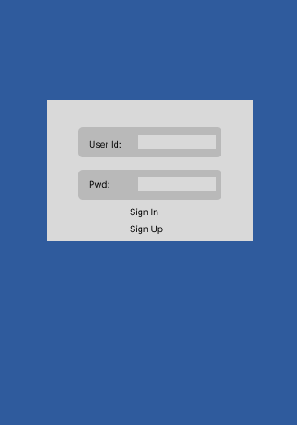
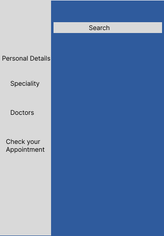
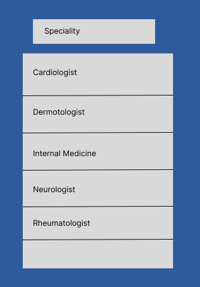
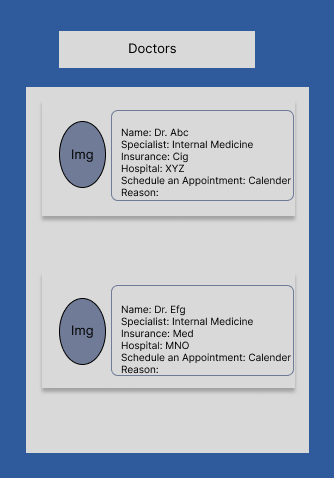
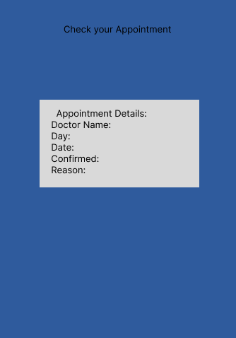

# **About the project:**

It's an app for scheduling appointment with doctor's. All the doctor's with different specialization are going to be on the App. Anyone after signing can schedule an appointment with the doctors. In which every person have their own personal information page. 

## Wireframe of the Project:

## ** Built With: **

1. 

2. 

3. 

4. ![MERN] ( )

5. [!Figma] ( )

6. [!Bootstrap] ( )

## ** Usage: **

Ability to bring all the doctor's from the near by location and from all the hospital on the same database so that it will be easy for anyone to check in the Insurance and book an appointment. Check all the doctor's from the near by location and schedule an appointment directly with them. 

## **Author and contact:**

B_Nagarkoti;
indu.ghugtyal@gmail.com

## **Acknowledgment**

### My Instructors: Abraham E. Tavarez, Colton Wright, Laura Minaya
  

